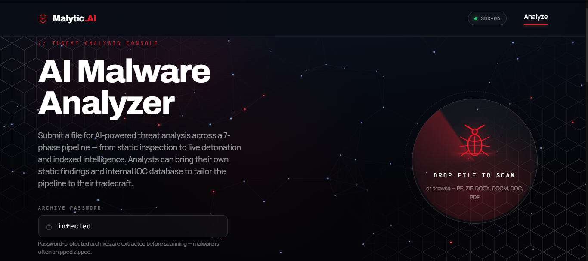

# Malytic.AI

**An AI-powered malware analysis platform where Claude acts as the analyst — not just a scanner.**

Malytic.AI takes a malware sample and runs it through a seven-phase analysis pipeline, using Claude as the reasoning engine to interpret evidence, correlate findings across phases, reach its own verdict, and produce a complete threat-intelligence package — a dual-audience report plus validated, SIEM-ready detection rules — automatically.

---

## The Problem

Malware never stops arriving, but expert analysts are scarce and slow to scale. A single sample can take a skilled analyst two to four hours to fully triage — reverse-engineering the binary, detonating it safely, correlating behavior against known threats, and writing detection rules. Meanwhile, a SOC receives hundreds or thousands of alerts a day. The result is a permanent backlog: most samples are never deeply analyzed, and the ones that are depend heavily on which analyst happened to pick them up.

This creates three compounding gaps:

- **Speed.** By the time a human finishes analyzing a new threat and writes a detection for it, the attacker has often already rotated infrastructure, repacked the payload, or moved on to the next victim.
- **Consistency.** Analysis quality varies with experience and fatigue. A junior and a senior analyst can produce very different conclusions from the same file — and even the same analyst produces different depth at hour one versus hour eight.
- **Coverage.** Modern malware is deliberately evasive — packed, obfuscated, sandbox-aware, and designed to look clean to automated tools. Signature-based scanners miss what they haven't seen before, and analysts simply cannot manually inspect everything that comes in.

Malytic.AI closes these gaps by putting Claude — reasoning as an analyst — at the center of an automated pipeline, giving every SOC team the analytical depth of a senior threat analyst on every single sample, in minutes instead of hours.

---

## Core Concept: Claude as the Analyst

Most malware tools extract data and hand you raw output to interpret. Malytic.AI is different: **Claude reasons over the evidence** at every phase. Tools only extract facts; the sandbox only executes the sample; Claude interprets, correlates, and concludes.

Claude reaches its **own verdict** and cross-checks it against the tool and sandbox verdicts — so when an evasive sample produces a "clean" sandbox result, the platform can recognize that silence itself as suspicious, rather than blindly trusting it.

Each analysis phase is driven by a dedicated skill file (a structured system prompt), not hardcoded family logic — keeping the platform **file-type and family agnostic**. It has been validated across diverse real samples: infostealers, RATs, ransomware, malicious Office macro documents, and PDFs.

---

## Architecture: The Seven-Phase Pipeline

Every sample flows through a JSON "case file" that persists in a database — each phase reads the prior phases' results and writes its own, so nothing is lost and the pipeline survives restarts.

| # | Phase | What it does |
|---|-------|--------------|
| 1 | **Intake** | Inert byte handling, hashing, file-type detection, archive extraction, routing (PE / Office / PDF) |
| 2 | **Static Analysis** | Type-appropriate extraction (PE, Office macros, PDF structure) — Claude interprets the raw facts |
| 3 | **Dynamic Analysis** | Live detonation in the Triage cloud sandbox — process behavior, network/C2, PCAP, and screenshots read by Claude's vision |
| 4 | **OSINT** | Threat-intelligence enrichment (reputation, known-family intelligence) |
| 5 | **Correlation / Attribution** | Claude fuses all phases into a verdict, family identification, and MITRE ATT&CK mapping |
| 6 | **Detection Engineering** | Generates and validates YARA, Sigma, and Suricata rules (with auto-repair) |
| 7 | **Reporting + SIEM Push** | Produces a threat-intel report and pushes IOCs + detection rules into Elastic |

The pipeline fails gracefully — if one phase errors, the others continue and the report reflects what was recovered.

---

## Analyst-Augmented Analysis

Malytic.AI runs fully automated, but it's built to respect expert workflows. Analysts stay in control through an advanced-analysis mode:

- **Bring your own static findings** — provide your own static analysis; the platform skips its static phase and continues from yours.
- **Bring your own dynamic findings** — provide results from your own sandbox; the platform skips detonation and uses them.
- **Internal IOC database** — cross-reference a sample's indicators against your organization's known-attacker IOCs to detect repeat adversaries, then export an updated database with the new sample's indicators merged in.
- **OSINT pause & resume** — pause the pipeline before OSINT to run your own threat-intel research (private feeds, dark web, custom tooling), then upload your findings and resume. The paused state persists across restarts.

Provenance is tracked throughout — the report clearly notes which findings were analyst-provided versus platform-generated.

---

## Output

**Threat-intelligence report** — a dual-audience report (executive summary + technical detail) with a verdict, confidence rating, malware family, MITRE ATT&CK mapping, defanged IOCs, an attack narrative, and detonation screenshots embedded as proof.

**SIEM integration** — validated detection rules across three layers, pushed into Elastic:
- **YARA** for file/content detection
- **Sigma** for endpoint behavior detection (translated to the SIEM's query language)
- **Suricata** for network/C2 detection

IOCs and detection rules land directly in Kibana, ready for threat hunting and alerting.

---

## Tech Stack

| Layer | Technology |
|-------|-----------|
| Analysis engine | Claude (skills-based — one SKILL.md per phase) |
| Backend | FastAPI (async), background-task pipeline |
| Case storage | SQLite (persistent case files, restart-safe) |
| Frontend | React + Vite (single-page dashboard) |
| Sandbox | Triage cloud sandbox |
| SIEM | Elasticsearch + Kibana |
| Detection | YARA, Sigma, Suricata (with real validation + auto-repair) |

---

## Key Design Principles

- **Claude as analyst, not relay** — Claude reaches its own conclusions and cross-checks tool/sandbox verdicts.
- **Skills, not hardcoded logic** — each phase loads a structured skill, keeping the platform general across file types and families.
- **Honest confidence** — the platform reports how sure it is, and fails gracefully rather than fabricating.
- **Safety first** — samples are handled inert; detonation happens only in the isolated Triage cloud sandbox; all indicators are defanged in reports.
- **Validated detection** — generated rules are actually compiled/parsed and auto-repaired before deployment, so broken rules never reach the SIEM.

---

## Author

**Belal Qatoum**

---

*Malytic.AI is a research/educational project. Malware samples are never included in this repository and must only be handled in isolated, controlled environments.*
